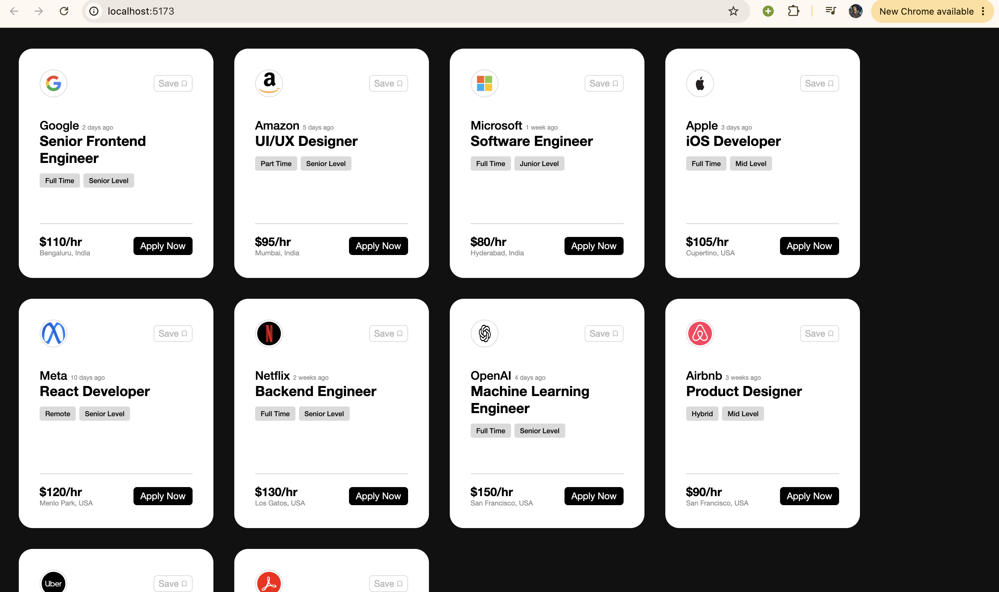

# React Job Cards Project

A responsive React application that displays modern job cards for different companies. This project was built to practice React fundamentals such as components, props, and rendering data.

## 📸 Preview



---

## 🚀 Features

- Responsive job card layout
- Reusable React components
- Company logos
- Job title and company information
- Employment type and experience level tags
- Salary and location display
- Clean and modern UI

---

## 🛠️ Technologies Used

- React
- Vite
- JavaScript (ES6+)
- CSS3
- HTML5

---

## 📁 Project Structure

```text
04-cards-project
│
├── image
│   └── preview.png
├── public
├── src
│   ├── components
│   ├── App.jsx
│   ├── main.jsx
│   └── ...
├── README.md
└── package.json
```

---

## ▶️ Getting Started

Clone the repository:

```bash
git clone https://github.com/habib-868/react-new01.git
```

Navigate to the project folder:

```bash
cd 04-cards-project
```

Install dependencies:

```bash
npm install
```

Start the development server:

```bash
npm run dev
```

---

## 📚 What I Learned

- Creating reusable React components
- Passing data using props
- Organizing React project files
- Rendering lists using the `map()` method
- Building responsive UI layouts

---

## 👨‍💻 Author

**Habibullah**

GitHub: https://github.com/habib-868
